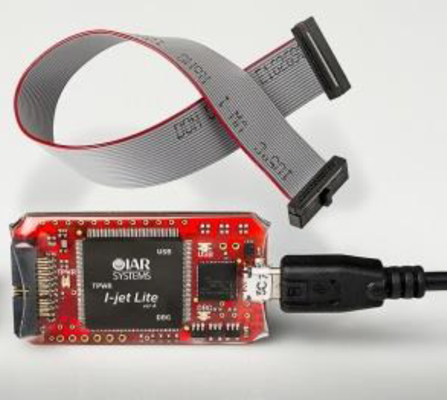
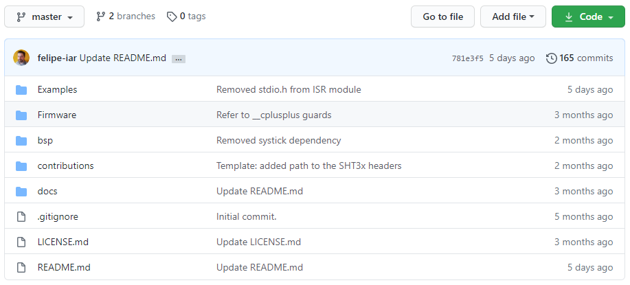
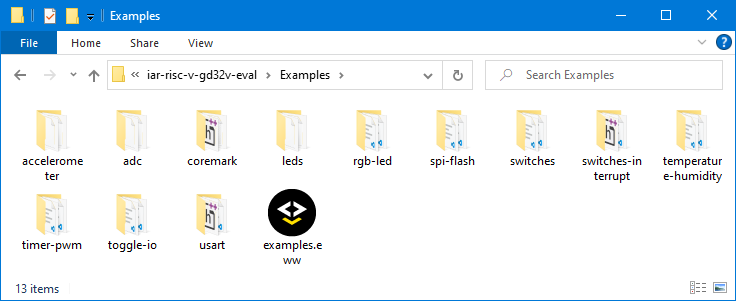
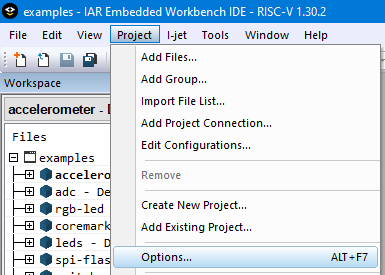
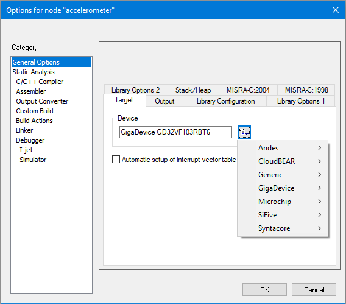
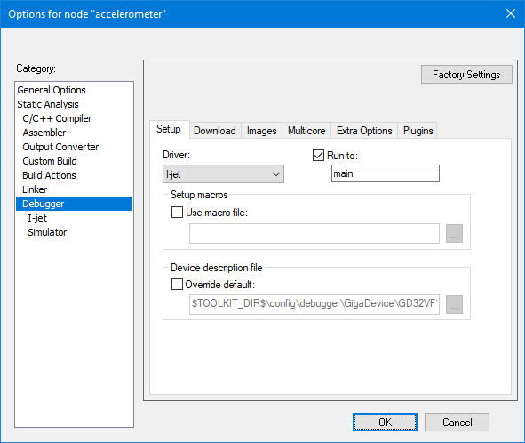

# Getting started with the IAR RISC-V GD32V Eval board

This guide briefly describes how to get started using __[IAR Embedded Workbench for RISC-V](https://www.iar.com/riscv)__ with the __I-jet Lite__ debug probe, to run an example application on the [IAR RISC-V GD32V Eval board](https://iar.com/evalkit). 

## Table of contents

### IAR RISC-V GD32V Eval board at a glance
* GD32VF103RBT6 RISC-V GigaDevice MCU
* User [LEDs](../Examples/leds)
* [RGB LED](../Examples/rgb-led)
* User [switches](../Examples/switches)
* [Potentiometer](../Examples/potentiometer)
* I²C 3-axis [accelerometer](../Examples/potentiometer)
* I²C [temperature-humidity](../Examples/temperature-humidity) sensors
* Light sensor
* On-board microphone
* iPhone compatible earbud jack
* [SPI flash](../Examples/spi-flash) memory
* Reset button 
* JTAG connector 20-pin 0.05” 
* USB micro-B connector for USB/Serial converter 
* Powered supplied directly through USB micro-B connector or through I-jet Lite (pin 11/13 JTAG connector)

### I-jet Lite debug probe 
* MCU support: RISC-V, Arm Cortex-M/A/R devices 
* JTAG/SWD(/SWO) debugging support 
* Flash download into supported evaluation boards 
* Up to 5V target interface voltage 
* MIPI-20 cable and USB-micro cable included 
* Fully integrated with IAR Embedded Workbench 
* RoHS/CE compliant (used with starter kit only)

 
## 1.	Install IAR Embedded Workbench for RISC-V

Please refer to the installation instructions from the welcome e-mail for the RISC-V evaluation kit.

## 2.	Set up the evaluation board

1. Connect your computer and the I-jet Lite debug probe using the USB-micro cable (packing with the I-jet Lite). Do not connect the I-jet Lite to the evaluation board yet.
2. The “USB” LED on the front side of the I-jet Lite will be lit with green when Windows completes searching for a USB driver. 
3. Connect the I-jet Lite to the JTAG __J11__ connector. 
4. Connect your computer and the USB-mini B connector using the USB-mini cable. Optionally the power supply can be provided from I-jet Lite. See the section [Target power supply from I-jet Lite for more details](5-target-power-supply-from-i-jet-lite). 

## 3.	Running example applications

When you have installed and set up all the software and hardware, you can try one of the example applications provided for IAR Embedded Workbench For trial projects you can access the [board's repository](https://github.com/IARSystems/iar-risc-v-gd32v-eval) at the [IAR Systems GitHub page](https://github.com/IARSystems).

1. Clone (or download) the repository for the [IAR RISC-V GD32V Eval board](https://github.com/IARSystems/iar-risc-v-gd32v-eval).

2. From the Windows Start menu, launch the __IAR Embedded Workbench IDE__ by choosing __IAR Systems__ → __IAR Embedded Workbench for RISC-V__.

3. Open the Examples Workspace by selecting `File → Open Workspace`, navigate to the [Examples](Examples) folder and choose the __Examples.eww__ file.

4. Right-click on the desired project and select `Set as Active`.

5. Choose `Project` → `Make` (or <kbd>F7</kbd>) or click the `Make` button on the main toolbar to compile and link the project.

6. Choose `Project` → `Download and Debug` (or <kbd>CTRL</kbd> + <kbd>D</kbd>) or click the `Download and Debug` button on the _Debug Toolbar_.

7. Use the default settings in the hardware setup dialog box that is displayed. Click `OK`. This will cause your application to be downloaded to the evaluation board.

8. The source file including the _main()_ function is now displayed in the editor window and the application is stopped at the entry point.

9. Click `Debug` → `Go` (or <kbd>F5</kbd>) or click the `Go` button on the _Debug Toolbar_ to start the application. 

10. To halt the execution, choose `Debug` → `Break` or click the `Break` button on the _Debug toolbar_.

11.	To exit C-SPY, choose `Debug` → `Stop Debugging` (or <kbd>CTRL</kbd> + <kbd>SHIFT</kbd> + <kbd>D</kbd>) or click the `Stop Debugging` button on the _Debug Toolbar_.

> __Note__
> * You can select a new project of the workspace and repeat the process to try it.
> * Each project comes with its own __README.md__ file which might provide directions on the board setup for the chosen project.

##  4. Viewing and editing project options

1. On the `Project` menu, select `Options`. Make sure the project name is highlighted in the workspace window and a dialog box will be displayed.

 
2. The Options dialog box provides options for the building tools and the debugger. For example, by selecting processor family and device under General Options in the category list to, the correct linker configuration file and device description file are automatically chosen for this device.

 
3. Select `Debugger` in the category list to verify what options are used.

4. The option `Run to` is used to specify the location to which C-SPY executes when the debugger is started and after a reset. By default, IAR Embedded Workbench will insert a breakpoint in the main() function automatically.

 
5. Click `OK` if you want to save your settings.

## 5. Target power supply from I-jet Lite

1. Choose `Project` → `Options` → `I-jet` → `Setup` to enable __Target power__ supply from the I-jet Lite. 

2. Then close the `1-2` pins (USB/Debug)  on the board's jumper __J6__.

## Board overview

 
## Troubleshooting
If you are unable to find the cause of a problem, try resetting the evaluation board by using the reset button on the board. Then restart the C-SPY Debugger in the IAR Embedded Workbench IDE. You can also try disconnecting and reconnecting the power to the evaluation board, pressing the reset button and then restarting C-SPY.

---
### Disclaimer
Information given in this document is intended as a help for the user. IAR Systems shall not be held liable for any losses or problems arising from using the information given in this document. 
